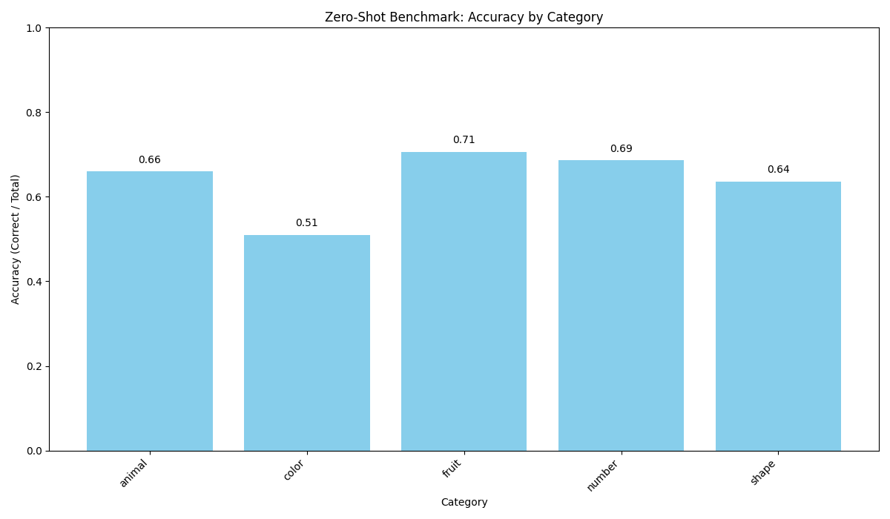
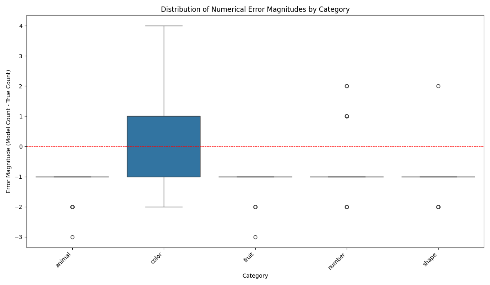
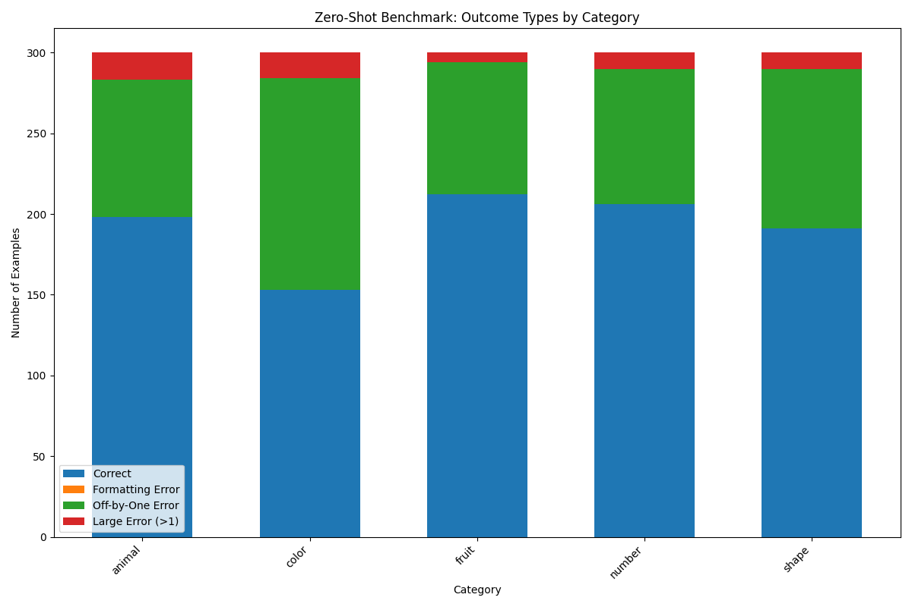

## Task Description

The primary objective is to evaluate a language model's ability to count items of a specific type within a given list and provide the answer in a precise format.

### Prompt Format

The model is given a prompt structured as follows:

```text
Count the number of words in the following list that match the given type, and put the numerical answer in parentheses. Output only the answer in parentheses.
Type: [Category Type]
List: [Word List]
Answer: ([Correct Count])
```

**Example:**

```text
Count the number of words in the following list that match the given type, and put the numerical answer in parentheses. Output only the answer in parentheses.
Type: fruit
List: [dog apple cherry bus cat grape bowl]
Answer: (3)
```

### Objectives

1.  **Dataset Creation**: Generate a dataset of several thousand examples following the format above.
2.  **Zero-Shot Benchmarking**: Benchmark open-weight Language Models (LMs) on this task using zero-shot inference (i.e., without providing examples in the prompt or fine-tuning, and without reasoning tokens).
3.  **Causal Mediation Analysis (Future Work)**: For a single model, conduct a causal mediation analysis experiment. This involves patching hidden states from one run to another to investigate whether specific layers develop a representation of the running count of matching words while processing the input list.

---

## Benchmarking Results

This section presents the benchmarking results for different models on the counting task.

### GPT-4o

The following results were obtained by running the `benchmark.py` script with the `gpt-4o` model.

#### Detailed Category Performance (gpt-4o)

Category: animal
  Total: 300
  Correct: 198 (Accuracy: 0.66)
  Formatting Errors: 0
  Off-by-One Errors: 85
  Large Errors (>1): 17
  Avg. Abs. Error Magnitude (for numerical errors): 1.18
  Error Bias (model - true): -1.18

Category: color
  Total: 300
  Correct: 153 (Accuracy: 0.51)
  Formatting Errors: 0
  Off-by-One Errors: 131
  Large Errors (>1): 16
  Avg. Abs. Error Magnitude (for numerical errors): 1.12
  Error Bias (model - true): 0.14

Category: fruit
  Total: 300
  Correct: 212 (Accuracy: 0.71)
  Formatting Errors: 0
  Off-by-One Errors: 82
  Large Errors (>1): 6
  Avg. Abs. Error Magnitude (for numerical errors): 1.08
  Error Bias (model - true): -1.08

Category: number
  Total: 300
  Correct: 206 (Accuracy: 0.69)
  Formatting Errors: 0
  Off-by-One Errors: 84
  Large Errors (>1): 10
  Avg. Abs. Error Magnitude (for numerical errors): 1.11
  Error Bias (model - true): -0.79

Category: shape
  Total: 300
  Correct: 191 (Accuracy: 0.64)
  Formatting Errors: 0
  Off-by-One Errors: 99
  Large Errors (>1): 10
  Avg. Abs. Error Magnitude (for numerical errors): 1.09
  Error Bias (model - true): -1.06

#### Overall Summary (gpt-4o)

Total Examples: 1500
  Overall Correct: 960 (64.00%)
  Overall Formatting Errors: 0 (0.00%)
  Overall Off-by-One Errors: 481 (32.07%)
  Overall Large Errors: 59 (3.93%)

---

### GPT-4o

*(This section will be populated with results from GPT-4o. For now, visual summaries are provided below.)*

#### Visual Summaries (gpt-4o)

**Category Accuracy (Detailed)**


**Error Magnitudes**


**Outcome Types by Category**


---

## Causal Mediation Analysis

*(This section is pending completion of the analysis.)*